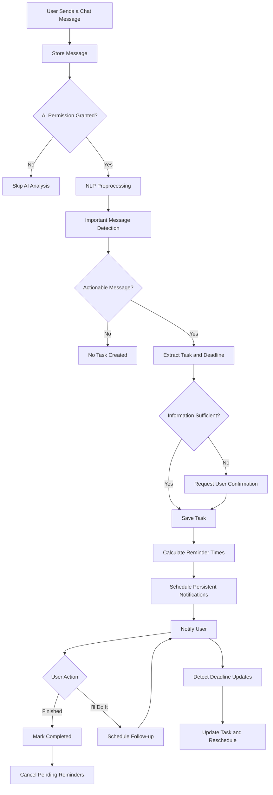
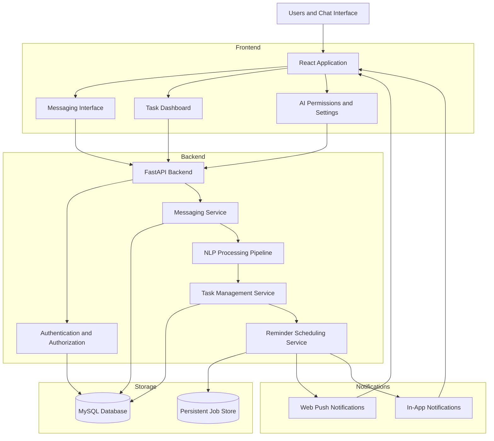

# chatreminder
An NLP-powered smart messaging platform that detects important announcements, extracts tasks and deadlines, and delivers intelligent reminders with automatic follow-ups until task completion.
# SmartChat AI 🧠💬

### NLP-Based Intelligent Chat Monitoring and Deadline Reminder System

**Never miss an important announcement hidden in a busy chat again.**

SmartChat AI is an intelligent messaging platform that combines real-time chat functionality with Natural Language Processing (NLP) to identify important announcements, extract actionable tasks, understand deadlines, and schedule personalized reminders.

Unlike conventional reminder applications that require users to enter tasks manually, SmartChat AI aims to transform ordinary conversations into actionable tasks automatically.

The system includes permission-controlled chat analysis, intelligent deadline extraction, configurable reminder scheduling, deadline-change detection, and persistent follow-up notifications until task completion.

> **Project status:** In development. Features and technology choices may evolve as implementation progresses.

---

## 📌 Table of Contents

* [Overview](#-overview)
* [Problem Statement](#-problem-statement)
* [Proposed Solution](#-proposed-solution)
* [Key Features](#-key-features)
* [How It Works](#-how-it-works)
* [System Architecture](#-system-architecture)
* [Intelligent Reminder System](#-intelligent-reminder-system)
* [Example Use Case](#-example-use-case)
* [Technology Stack](#-technology-stack)
* [Database Design](#-database-design)
* [Getting Started](#-getting-started)
* [Project Structure](#-project-structure)
* [Privacy and Security](#-privacy-and-security)
* [Future Enhancements](#-future-enhancements)
* [Contributing](#-contributing)
* [License](#-license)

---

## 🚀 Overview

Modern communication platforms contain a large amount of information, including assignments, project submissions, examination schedules, meetings, and other important announcements.

Important deadlines can easily be missed when they are buried among hundreds of messages.

SmartChat AI addresses this problem by integrating an AI-powered assistant directly into a messaging application.

Users can create individual conversations and groups, selectively authorize the AI to analyze specific chats, and receive automatically generated task reminders based on the content of their messages.

The primary objective is to reduce missed deadlines and minimize the need to manually track important information across multiple conversations.

## 🎯 Problem Statement

Students, employees, and teams frequently receive important instructions through group chats and individual conversations. Traditional messaging applications primarily serve as communication tools and may require users to manually create tasks or reminders.

This creates several challenges:

* Important announcements become difficult to find in busy conversations.
* Users may forget assignment and project deadlines.
* Natural-language expressions such as "submit this by 4 PM today" require manual interpretation.
* Changes to previously announced deadlines may go unnoticed.
* Conventional reminders do not always support persistent follow-ups until a task is completed.
* Users need control over which conversations an AI assistant can analyze.

SmartChat AI aims to address these challenges through NLP-based information extraction, permission-controlled message analysis, and automated reminder management.

## 💡 Proposed Solution

SmartChat AI combines three main components:

1. **Messaging Platform:** Supports individual chats, group conversations, and message history.
2. **NLP Intelligence Engine:** Identifies actionable messages and extracts tasks, deadlines, senders, and relevant contextual information.
3. **Intelligent Reminder Engine:** Schedules notifications, supports postponement, tracks completion, and recalculates reminders when deadlines change.

The system is designed to convert unstructured chat messages into structured, manageable tasks.

## ✨ Key Features

### 💬 1. Real-Time Messaging

* Individual conversations between users.
* Group chats such as NLP, Java, Python, and Project Team.
* Message history with sender information and timestamps.
* Real-time message delivery.
* Searchable conversations and messages.

### 🔐 2. Permission-Controlled AI Monitoring

* Users explicitly choose which conversations the AI can analyze.
* Access permissions can be configured separately for each chat.
* Users can revoke permissions at any time.
* Backend authorization controls which messages enter the NLP pipeline.
* Unauthorized conversations are excluded from AI processing.

### 🧠 3. Intelligent Announcement Detection

The NLP engine identifies potentially actionable messages, including:

* Assignment submissions.
* Project deadlines.
* Examination schedules.
* Meetings and reviews.
* Attendance-related instructions.
* Fee payment deadlines.
* Other user-configured tasks.

The system aims to distinguish actionable instructions from ordinary conversation.

### 📅 4. Automatic Task and Deadline Extraction

The AI extracts structured information from natural-language messages, including:

* Task title and description.
* Original announcement.
* Sender and source conversation.
* Deadline date and time.
* Task category.
* Priority and intended audience, when identifiable.
* Reminder schedule.
* Task status.

Relative expressions such as "tomorrow", "next Monday", and "within five hours" are interpreted using the message timestamp and configured timezone.

Ambiguous dates and uncertain task interpretations can be presented to the user for confirmation.

### 🔔 5. Intelligent Deadline-Based Reminders

Reminder times are calculated according to the deadline and configured reminder policy.

Examples:

| Message                                | Example reminder                              |
| -------------------------------------- | --------------------------------------------- |
| "Complete the work before 4 PM today." | 3 PM today                                    |
| "Submit within the next five hours."   | One hour before the calculated deadline       |
| "Submit the project on October 10."    | October 8, using the default two-day rule     |
| "Meeting tomorrow at 10 AM."           | 9 AM tomorrow, when the one-hour rule applies |

Users can configure reminder preferences, including advance notice, snooze intervals, and quiet hours.

### 🔁 6. Persistent Follow-Up Reminders

Each task reminder provides two primary actions:

**Finished**

* Marks the task as completed.
* Records the completion time.
* Cancels pending reminders associated with that task.

**I'll Do It**

* Keeps the task pending.
* Schedules a follow-up reminder after the configured snooze interval.
* Uses ten hours as the default snooze interval.
* Applies deadline-aware rules to avoid scheduling inappropriate reminders after the deadline.

The system tracks task status and prevents duplicate reminder jobs.

### 🔄 7. Deadline Change Detection

When a new message changes an existing deadline, the system aims to:

* Identify the related task.
* Detect the updated deadline.
* Update the existing task rather than create an unrelated duplicate.
* Recalculate future reminders.
* Cancel obsolete reminder jobs.
* Notify the user about the change.
* Preserve the deadline-change history.

### 📊 8. Task Management Dashboard

The dashboard is designed to organize tasks into categories such as:

* Upcoming.
* Pending.
* Completed.
* Postponed.
* Overdue.

Users can search and filter tasks by deadline, category, priority, source conversation, and status.

### 📝 9. Announcement Summarization

Long announcements can be summarized into concise information containing the key instruction, required action, deadline, and relevant conditions.

### 🔎 10. Duplicate Announcement Detection

Semantically similar announcements can be linked to an existing task to reduce duplicate task creation and repeated notifications.

---

## 🔄 How It Works

The primary workflow is:

1. A user registers and signs in.
2. The user creates individual chats or groups.
3. The user explicitly enables AI access for selected conversations.
4. A new message arrives in an authorized chat.
5. The backend stores the message and checks the relevant permission.
6. The NLP engine analyzes the message for actionable information.
7. The system extracts the task, deadline, sender, and other relevant details.
8. The extracted information is validated and saved as a task.
9. The reminder engine calculates and persists the scheduled notification times.
10. The user receives a reminder.
11. The user selects **Finished** or **I'll Do It**.
12. The task status and future reminder schedule are updated.
13. Subsequent messages can update the task when a deadline changes.

### Workflow Diagram



---

## 🏗️ System Architecture

SmartChat AI is designed around a modular architecture.



The architecture separates messaging, NLP processing, task management, and notification scheduling to make the application easier to maintain, test, and extend.

---

## ⏰ Intelligent Reminder System

The reminder engine applies configurable scheduling rules to extracted deadlines.

### Default scheduling policy

* **Deadline today at a specific time:** Remind one hour before.
* **Deadline within 24 hours:** Remind one hour before, where feasible.
* **Deadline several days away:** Schedule a primary reminder two days before.
* **Optional final reminder:** Schedule another notification one hour before a known deadline.
* **Task postponed:** Use the configured snooze interval, ten hours by default, while accounting for the actual deadline.
* **Deadline updated:** Recalculate and replace obsolete reminders.
* **Task completed:** Cancel all remaining reminders.
* **Deadline passed:** Apply the configured overdue-task policy rather than scheduling notifications in the past.

All scheduled times should be timezone-aware and persisted so that reminders can survive application or server restarts.

---

## 🧪 Example Use Case

Consider a staff member sending the following message in an NLP group:

> "Students, complete your NLP project before 4 PM today."

If the student has authorized AI access to the NLP group, the system can extract:

| Field    | Extracted value      |
| -------- | -------------------- |
| Task     | Complete NLP project |
| Source   | NLP Group            |
| Sender   | Staff member         |
| Deadline | Today, 4:00 PM       |
| Reminder | Today, 3:00 PM       |
| Status   | Pending              |

At 3 PM, the user receives a notification containing the original announcement, the deadline, and the two task actions.

* **Finished:** The task is completed and future reminders are cancelled.
* **I'll Do It:** The task remains pending and a follow-up is scheduled according to the snooze and deadline policies.

This demonstrates the central objective of SmartChat AI: transforming ordinary conversation into an actionable task without requiring the user to create a reminder manually.

---

## 🛠️ Technology Stack

The following technologies are proposed for the project.

| Component               | Technology                                            | Purpose                                                |
| ----------------------- | ----------------------------------------------------- | ------------------------------------------------------ |
| Frontend                | React                                                 | Responsive messaging and dashboard UI                  |
| UI                      | HTML, CSS, JavaScript                                 | Interface and interaction                              |
| Backend                 | Python, FastAPI                                       | APIs and application logic                             |
| Real-time communication | WebSockets                                            | Live messaging                                         |
| Database                | MySQL                                                 | Users, conversations, messages, tasks, and permissions |
| NLP                     | spaCy and suitable pretrained models                  | Entity extraction and text processing                  |
| Date/time processing    | Python date/time libraries and a suitable date parser | Deadline interpretation                                |
| Semantic analysis       | Embeddings or a suitable language model               | Relating messages and detecting updates                |
| Scheduling              | Persistent task queue or background scheduler         | Reliable reminder execution                            |
| Notifications           | Web Push and in-app notifications                     | Delivering reminders                                   |

The final technology choices may change as implementation requirements are validated.

---

## 🗄️ Database Design

The database is expected to contain the following principal entities:

| Entity                  | Responsibility                                       |
| ----------------------- | ---------------------------------------------------- |
| Users                   | User profiles and authentication                     |
| Conversations           | Group and individual chat records                    |
| ConversationMembers     | Membership and conversation-level access             |
| Messages                | Message content, sender, conversation, and timestamp |
| AIChatPermissions       | Per-user authorization for AI processing             |
| Tasks                   | Extracted task details, deadlines, and status        |
| TaskReminders           | Scheduled reminder times and delivery status         |
| TaskStatusHistory       | Completion, postponement, and status changes         |
| DeadlineChangeHistory   | Previous and updated deadlines                       |
| NotificationPreferences | Snooze intervals, quiet hours, and reminder settings |

Use foreign keys, suitable indexes, unique constraints, and authorization checks to maintain data integrity and prevent duplicate task or reminder creation.

---

## 🚀 Getting Started

### Prerequisites

The intended development environment includes:

* Python 3.11 or a compatible supported version.
* Node.js and npm.
* MySQL Server.
* Git.

### Installation

Clone the repository:

```bash
git clone https://github.com/YOUR_USERNAME/smartchat-ai.git
cd smartchat-ai
```

The exact installation and startup commands depend on the implemented project structure.

Once the backend and frontend are available, document their individual setup steps here, including environment variables, database creation, dependency installation, migrations, and development server commands.

### Environment Configuration

Store credentials and application settings in environment variables rather than committing secrets to version control.

A future `.env.example` should document required settings such as:

```dotenv
DATABASE_URL=
SECRET_KEY=
FRONTEND_URL=
TIMEZONE=
```

Use placeholder values only in the example file. Never commit real passwords, API keys, or production credentials.

### Running the Application

The completed project should provide separate commands for starting the backend and frontend, followed by instructions for creating test users and demonstrating the messaging, NLP extraction, and reminder workflows.

**Note:** This README describes the intended system. Do not treat the application as runnable until the corresponding implementation and setup instructions are present in the repository.

---

## 🔐 Privacy and Security

Privacy is a core design requirement.

SmartChat AI should implement:

* Explicit, per-conversation AI permissions.
* Backend enforcement of access control.
* Secure authentication and password handling.
* Protection against unauthorized access to messages and tasks.
* Safe handling of stored message content.
* Permission revocation and clearly documented data-retention behavior.
* Restricted access to notification data.
* Environment-based configuration for sensitive credentials.

The application should analyze only conversations authorized by the relevant user and must not expose one conversation's private information to another.

---

## 🧭 Future Enhancements

Potential future improvements include:

* Multilingual announcement and deadline detection.
* Voice-message transcription and task extraction.
* AI-generated summaries of lengthy group discussions.
* Calendar integration.
* Email and mobile push notifications.
* Personalized task prioritization.
* Recurring task and event detection.
* Improved recognition of the intended audience.
* Offline-friendly task access.
* Analytics for completed, overdue, and postponed tasks.
* Optional integrations with external messaging platforms through their authorized APIs.

These enhancements are planned possibilities, not claims of existing functionality.

---

## 🤝 Contributing

Contributions, suggestions, and bug reports are welcome.

To contribute:

1. Fork the repository.
2. Create a feature branch.
3. Implement and test your changes.
4. Commit your changes with a descriptive message.
5. Open a pull request explaining the improvement.

Please include relevant tests for changes affecting NLP extraction, access control, deadline calculations, and reminder scheduling.

---

## 📄 License

Choose an open-source license before distributing the project. For example, the MIT License may be appropriate if you want others to use, modify, and distribute the code with minimal restrictions.

If you select MIT, add a `LICENSE` file containing the complete license text and update this section accordingly.

---

## 👨‍💻 Project Goal

SmartChat AI aims to make digital conversations more actionable by connecting NLP-based message understanding with reliable task and reminder management.

**From messages to tasks. From deadlines to timely reminders.**

The long-term vision is a privacy-conscious messaging platform where important information is automatically identified, organized, and followed up on until the user takes action.
